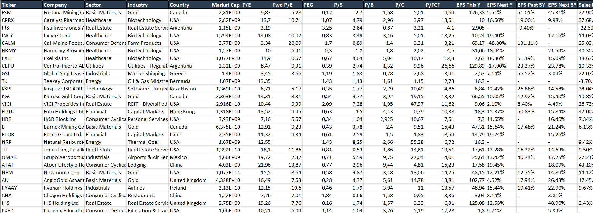
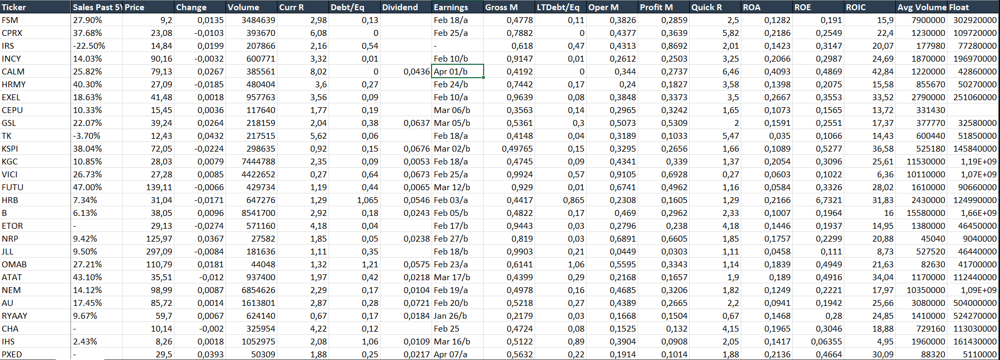
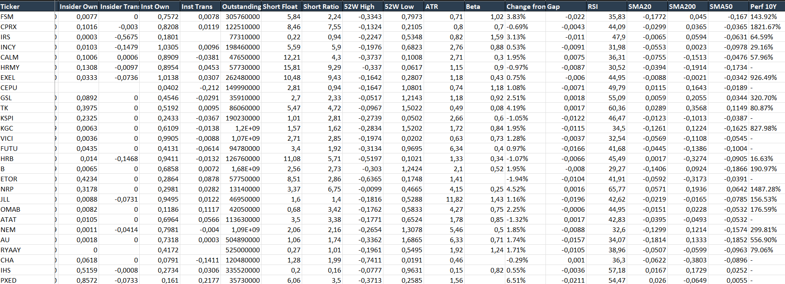
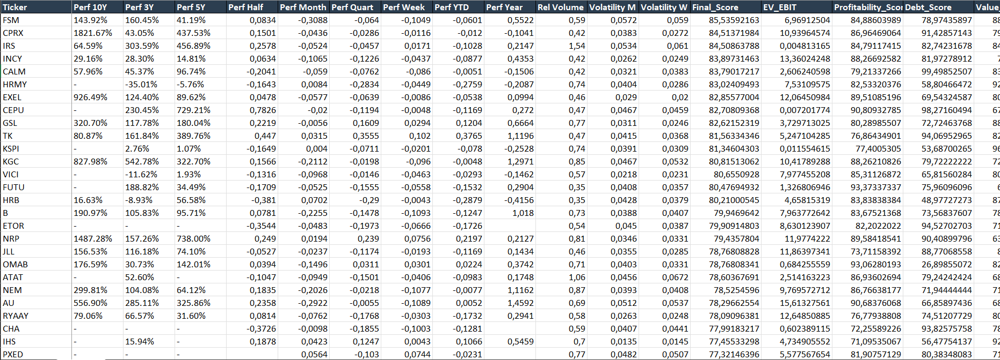
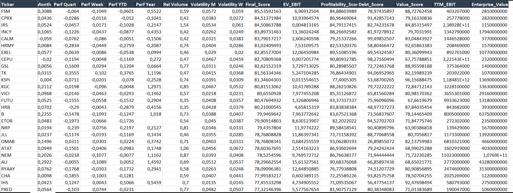

# 🚀 Finviz & Yahoo Finance Quant Scorer

[](https://www.python.org/downloads/)
[](https://opensource.org/licenses/MIT)
[](https://github.com/soneryavuz-dev)

An automated high-performance stock analysis tool that scrapes **Finviz** and **Yahoo Finance** data to perform automated multi-factor quant scoring (Profitability, Debt, Value) for global stock analysis.

---

## 📈 Overview

This project is designed for value investors and quantitative analysts. It automates the tedious process of gathering fundamental data and provides a sector-relative scoring system to identify undervalued "gems."

### 🧠 Methodology
The tool applies a **Percentile Ranking** approach within each sector:
- **Profitability (45%)**: ROIC, Operating Margin, Gross Margin, EPS Growth, ROE.
- **Financial Health (15%)**: Debt/Equity, LT Debt/Equity, Current Ratio.
- **Value (40%)**: P/FCF, EV/EBIT (Calculated via TTM), PEG, P/E, P/S.

---

## ✨ Key Features

* **Full Data Integration:** Merges Finviz screener data with Yahoo Finance real-time TTM (Trailing Twelve Months) metrics.
* **EV/EBIT Calculation:** Automatically calculates Enterprise Value and TTM EBIT for more accurate valuation than simple P/E.
* **Smart Caching:** Avoids rate limits and saves time by storing data in local `.csv` caches (valid for 4 hours).
* **Professional Reporting:** Generates a formatted `.xlsx` report with conditional column widths and headers.
* **Multi-threaded Scraping:** Uses `ThreadPoolExecutor` for high-speed data retrieval.

---

## 📊 Example Excel Report: The Power of Quant Scoring

The tool generates a formatted, detailed professional Excel report named `Stock_Analysis_Report.xlsx`. Below are screenshots showing how the different metrics are presented and, most importantly, the final scoring results.

### 📋 Overview & Basic Metrics (`image_1.png`)
Provides a basic snapshot including company profile, sector, country, market cap, P/E ratios, and EPS history.


### 💰 Profitability & Financial Health (`image_2.png`)
Visualizes key financial and profitability metrics like Gross Margin, Operating Margin, Debt/Equity ratios, and Returns (ROA, ROE, ROIC).


### 📈 Advanced Data & Technicals (`image_3.png`)
Includes advanced data points such as Insider and Institutional Transactions, Short Interest, technical indicators (RSI, Moving Averages), volatility, and 10-year performance.


---

### 🏆 Quant Scoring Results (The Key Output) (`image_4.png`)
**This is the most critical section.** It highlights the calculated results of the quantitative scoring system:
- **`Final_Score`**: The ultimate relative ranking.
- **`EV_EBIT`**: Enterprise Value / EBIT ratio, a key valuation metric.
- **`Profitability_Score`**: Based on metrics from `image_2.png`.
- **`Debt_Score`**: Evaluates financial health.

The table is color-coded to visually indicate top-performing stocks based on their final score.


### 🔍 Detailed Input Breakdown (`image_5.png`)
A deeper look into the individual scores and other technical metrics, including `Value_Score`, `TTM_EBIT` (Trailing Twelve Months Earnings Before Interest and Taxes), and `Enterprise_Value`.


## 🛠️ Installation & Usage

1. **Clone the repo:**
   ```bash
   git clone https://github.com/soneryavuz-dev/finviz-quant-scorer.git
   cd finviz-quant-scorer
   ```

2. **Install requirements:**
   ```bash
   pip install -r requirements.txt
   ```

3. **Run the analyzer:**
   ```bash
   python main.py
   ```
